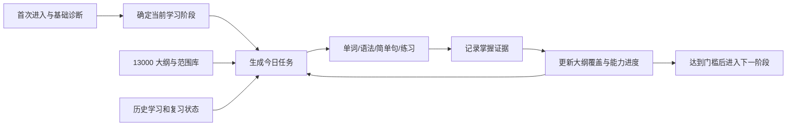

# 13000 英语（专升本）考试大纲与学习范围建设计划

> 文档角色：产品经理 / 项目经理交付件  
> 项目：本地 Web 英语学习系统  
> 目标课程：高等教育自学考试 `13000 英语（专升本）`  
> 计划日期：2026-08-02  
> 实施原则：官方事实可追溯、学习内容可执行、零基础用户不迷路、离线功能可用、不得伪造考试信息。

## 1. 为什么要做这次升级

当前系统已经能安排阶段化学习、保存进度、提供词典和练习，但“为什么今天学这些、它对应考试大纲的哪一部分、离考试要求还有多远”仍不够清楚。此次升级不是简单放入一份 PDF，而是建设一个可追踪的“13000 考试大纲中心”，让考试要求成为学习计划、课程内容、练习和进度分析的共同依据。

本次还必须修复现有 `public/data/exam_profile.json` 的中文乱码，并拆分其中混在一起的课程资料、考试安排和来源信息。

## 2. 已确认事实与信息边界

### 2.1 已由现行官方目录确认

- 课程代码：`13000`。
- 课程名称：`英语（专升本）`。
- 使用考试大纲：《英语（二）自学考试大纲》。
- 指定教材：《英语（二）自学教程》。
- 主编：张敬源、张虹。
- 出版社：外语教学与研究出版社。
- 版本：2012 年版。

当前官方目录把 13000 指向原《英语（二）》大纲和教材，因此产品可沿用旧代码 `00015 英语（二）` 的合法历史资料作为检索线索；但任何具体题型、分值、考点和范围仍须逐条核验，不能仅凭“新旧代码对应”直接推断。

### 2.2 当前可引用来源

1. 2026 年全国统考课程考试大纲、教材目录（政府教育部门发布的 PDF）：  
   `https://jyj.baoji.gov.cn/zzbb/zsks/202512/P020251203545772147442.pdf`
2. 2026 年 10 月上海市高等教育自学考试教材及考试大纲书目表（省级教育考试院 PDF，用于交叉核验）：  
   `https://www.shmeea.edu.cn/download/20260520/2.pdf`
3. 中国教育考试网自考大纲栏目（国家级来源入口）：  
   `https://zikao.neea.edu.cn/xhtml1/report/1704/244-1.htm`

### 2.3 尚未取得官方完整正文的内容

- 大纲所有章节的完整原文。
- 各能力项的逐条考核要求及层级措辞。
- 2026 年江西本课程确切题型、题量、分值和考试时长的完整官方说明。
- 指定教材全部单元与大纲考点的官方对应关系。

因此，开发时必须区分三种状态：

- `official`：官方来源直接确认，可按事实展示。
- `verified_summary`：基于合法取得的官方大纲或教材进行的人工转述，保留来源页码。
- `pending`：合理候选但尚未完成官方核验，只能在内部审核页显示，不得作为正式考试结论展示给学习者。

## 3. 产品目标

完成后，用户应能回答以下问题：

1. 我参加的是什么课程，使用什么考试大纲和教材？
2. 这门考试要求哪些词汇、语法和语言能力？
3. 我现在处于哪个学习阶段，为什么今天要学这些？
4. 每项学习任务对应哪条大纲能力或哪项前置能力？
5. 哪些范围已覆盖、掌握得怎样、哪些还是空白？
6. 题型信息来自哪里，是否已经官方核验？
7. 如果我从零基础开始，系统为什么不会直接让我做过难的真题？

## 4. 不做的事情

- 不把来源不明的培训网站文章包装成“官方大纲”。
- 不在没有证据时写死题型、题量、分值或考试时长。
- 不整本复制受版权保护的教材、大纲书或商业题库。
- 不因追求“内容多”而为零基础用户一次性展示全部考试术语。
- 不用累计学习天数代替真实掌握度。
- 不加入必须联网才能完成的核心学习功能。

## 5. 核心用户路径



大纲是规划依据，不直接替代教学。零基础阶段的任务仍以高频词、基础语法和简单句为主，同时在后台标注其属于“考试前置能力”或具体大纲能力。

## 6. 信息架构

### 6.1 新增一级入口：考试大纲

页面至少包含：

- 课程事实卡：代码、名称、大纲、教材、版本、来源和最近核验时间。
- 大纲树：按“语言知识—语言技能—综合应用—考试任务”浏览。
- 范围矩阵：词汇、语法、阅读、翻译、写作等能力的要求、当前覆盖和掌握状态。
- 教材映射：教材单元或主题与大纲能力、站内课程的对应关系。
- 题型说明：只显示已核验信息；未核验项明确显示“等待官方材料核验”。
- 来源说明：每项结论的来源、级别、发布日期、核验日期和直接链接。

### 6.2 首页联动

- 显示“本周覆盖的大纲能力”。
- 显示“当前阶段目标”和“进入下一阶段还差什么”。
- 今日任务卡增加“为什么学”和“对应范围”。
- 不用单一百分比制造虚假精确感；至少分别展示覆盖率和掌握率。

### 6.3 学习页联动

每个教学模块显示一个简短标签，例如：

- `前置能力：be 动词简单句`
- `大纲能力：理解句子主干`
- `考试应用：短文阅读定位`

用户点击标签可查看对应大纲节点，但不强迫离开当前学习流程。

## 7. 数据设计

所有 JSON 文件统一使用 UTF-8，无 BOM；运行测试必须检查中文是否出现乱码。

### 7.1 `public/data/exam/source_registry.json`

记录所有依据，字段建议：

```ts
type SourceRecord = {
  id: string;
  title: string;
  authority: "national_exam_authority" | "provincial_exam_authority" | "government_education_department" | "official_publisher" | "licensed_material" | "secondary_lead";
  url?: string;
  publicationDate?: string;
  retrievedAt: string;
  documentVersion?: string;
  pageOrSection?: string;
  checksum?: string;
  status: "active" | "superseded" | "unavailable" | "pending_review";
  notes?: string;
};
```

优先级固定为：国家教育考试权威来源 > 江西省教育考试院 > 其他省级考试院或政府教育部门的现行全国目录 > 官方出版社/合法持有的指定材料 > 其他线索。`secondary_lead` 只能帮助寻找来源，不能支持正式结论。

### 7.2 `public/data/exam/course_profile.json`

只保存课程事实，不保存报名日期等容易变化的信息：

- currentCode / currentName
- legacyCode / legacyName（标注关系依据和置信度）
- syllabusName
- textbook metadata
- regionApplicability
- effectiveFrom / reviewedAt
- sourceRefs
- verificationStatus

考试日期、报名时间等另放 `exam_sessions.json`，避免把“课程永久事实”和“某次考试安排”混在一起。

### 7.3 `public/data/exam/syllabus_outline.json`

建立可嵌套大纲节点：

```ts
type SyllabusNode = {
  id: string;
  parentId?: string;
  title: string;
  summary: string;
  category: "knowledge" | "vocabulary" | "grammar" | "reading" | "translation" | "writing" | "exam_task" | "prerequisite";
  requirementLevel: "recognize" | "understand" | "apply" | "integrate";
  importance: "core" | "important" | "supporting";
  stageIds: string[];
  lessonIds: string[];
  prerequisiteNodeIds: string[];
  evidenceRule: string;
  sourceRefs: Array<{ sourceId: string; pageOrSection?: string }>;
  verificationStatus: "official" | "verified_summary" | "pending";
};
```

注意：未取得完整大纲前可以先建结构和 `pending` 节点，但不能用臆测内容填充 `summary` 后直接上线。

### 7.4 `public/data/exam/exam_scope.json`

把“考什么”和“为了能考而先学什么”分开：

- `examRequired`：由大纲明确要求。
- `prerequisite`：零基础用户必须补齐，但不声称是单独考点。
- `supporting`：用于理解教材或提高正确率。
- `outOfScope`：明确不纳入当前三个月计划的内容。

每项范围包含优先级、预计学习量、目标周次、关联节点、关联课程和核验状态。

### 7.5 `public/data/exam/question_types.json`

字段包括：题型名称、能力目标、作答形式、题量、分值、建议时间、来源、适用考期和核验状态。除非有官方大纲或可合法核验的近期真实试卷证据，否则 `questionCount`、`score`、`duration` 必须为空，不得生成“看起来合理”的数字。

### 7.6 `public/data/exam/textbook_map.json`

只记录教材单元元数据和转述后的学习目标：

- unitId / title
- learningObjectives
- syllabusNodeIds
- lessonIds
- vocabularySetIds / grammarPointIds
- coverageStatus
- sourceRefs / pageRange

不得复制教材课文、长篇例句、练习题和答案。若用户日后导入合法持有材料，应作为用户本地数据保存，不打入公开安装包。

### 7.7 学习证据与覆盖数据

新增或扩展本地存储：

- `syllabusNodeProgress`：节点覆盖、首次学习、最近复习、熟练度、证据数量。
- `learningEvidence`：练习、听写、造句、翻译、阅读或写作结果。
- `contentVersion`：大纲数据版本，用于数据升级。

覆盖率 = 已实际学习的有效节点权重 / 当前阶段应覆盖节点权重。  
掌握率 = 达到该节点证据门槛的节点权重 / 已覆盖节点权重。  
两者必须分开显示。

## 8. 大纲内容的组织框架

在拿到完整合法材料后，按以下框架逐条录入和核验：

1. 课程性质和学习目的。
2. 总体能力要求。
3. 词汇知识及运用要求。
4. 语法知识及运用要求。
5. 阅读理解能力。
6. 英汉语言转换/翻译能力。
7. 书面表达能力。
8. 综合语言应用能力。
9. 考核方式和题型要求。
10. 教材单元与考核目标关系。

这一框架是产品数据分类，不代表已经取得的大纲原文章节标题。最终显示名称必须以合法取得的完整大纲为准。

## 9. 与零基础阶段路线的对应

### 阶段 1：起步准备（建议第 1—3 周）

目标：形成最小可用语言系统。

- 高频基础词和词形意识。
- 字母、基础发音和查词能力。
- be 动词、一般现在时、代词、冠词、名词单复数。
- 肯定句、否定句、一般疑问句、特殊疑问句。
- 极短句阅读和仿写。

此阶段主要标注为 `prerequisite`，不把用户直接推向长阅读和整套真题。

### 阶段 2：基础句法（建议第 4—5 周）

- 句子成分和基本句型。
- 常用时态、情态动词、比较结构、介词结构。
- 简单句扩展、并列关系和基础从句识别。
- 80—120 词短文的句子级理解。

### 阶段 3：大纲核心能力（建议第 6—8 周）

- 按已核验大纲范围训练词汇、语法和阅读。
- 从教材映射中选择对应内容。
- 开始短句翻译和段落写作。
- 每周检查“范围覆盖空白”。

### 阶段 4：题型应用（建议第 9—10 周）

- 只使用已核验题型。
- 将词汇、语法、阅读、翻译、写作迁移到考试任务。
- 按错因而不是只按总分反馈。

### 阶段 5：整合与冲刺（建议第 11—12 周）

- 按覆盖缺口补课。
- 使用合法材料进行限时综合训练。
- 形成个人高频错误清单、复习清单和最后两周任务。

阶段周数是产品初始配置，诊断结果和学习证据可以调整进度；不得仅因日期到达而自动升级。

## 10. 今日任务生成规则

规划器按以下顺序选取任务：

1. 到期复习。
2. 当前阶段未掌握的前置节点。
3. 本周目标中的核心大纲节点。
4. 最近错误对应的薄弱节点。
5. 输出练习和阶段检测。

每个任务必须带 `syllabusNodeIds` 或 `prerequisiteNodeIds`。若某内容没有任何范围关联，应进入内容审核队列，不直接分配。

建议学习量不要再固定为 75 分钟。保留 45/90/150 分钟模式，但默认完整模式可设为 90—120 分钟，并按阶段改变配比：

| 阶段 | 单词 | 语法 | 句子/阅读 | 翻译/写作 | 复习与检测 |
|---|---:|---:|---:|---:|---:|
| 1 | 30% | 30% | 20% | 5% | 15% |
| 2 | 25% | 30% | 25% | 5% | 15% |
| 3 | 20% | 20% | 30% | 15% | 15% |
| 4 | 15% | 15% | 30% | 20% | 20% |
| 5 | 10% | 10% | 25% | 25% | 30% |

## 11. 开发工作包与顺序

### WP0：资料审计与风险冻结（P0）

- 修复现有考试资料中文乱码。
- 建立来源登记表。
- 用至少两个现行官方目录交叉确认课程、教材和大纲信息。
- 寻找江西官方专业计划、考试安排及合法完整大纲。
- 审计现有项目里题型、分值、考试日期和“官方”措辞，未知内容降级为待核验。
- 输出《资料缺口清单》，未通过核验的内容不得作为官方信息上线。

交付：`source_registry.json`、修复后的 `course_profile.json`、资料缺口清单、数据审计测试。

### WP1：数据模型与迁移（P0）

- 增加大纲、范围、题型、教材映射和学习证据类型。
- 拆分旧 `exam_profile.json`。
- 为旧 IndexedDB/JSON 备份增加迁移函数。
- 增加数据版本和向后兼容处理。

交付：类型定义、种子数据加载器、迁移代码和单元测试。

### WP2：大纲资料中心（P1）

- 新增“考试大纲”入口和页面。
- 实现课程事实卡、大纲树、范围矩阵、教材映射、题型说明和来源抽屉。
- 支持按能力、阶段、状态筛选。
- 对 `pending` 内容使用清晰的待核验样式，默认不计入正式范围统计。

交付：响应式页面、空状态、离线读取和无障碍键盘操作。

### WP3：阶段与规划器联动（P1）

- 为课程、单词、语法点、句子和问题关联大纲节点。
- 今日任务显示学习理由和范围标签。
- 阶段升级加入大纲节点掌握门槛。
- 零基础用户优先学习前置能力。

交付：更新后的 planner、课程数据、阶段判定测试。

### WP4：覆盖分析与学习反馈（P1）

- 分别计算覆盖率和掌握率。
- 首页展示本周目标、范围缺口和下一阶段条件。
- 错题和复习项反向更新大纲节点熟练度。
- 备份中包含大纲进度与内容版本。

交付：进度组件、统计函数、迁移与恢复测试。

### WP5：内容补齐与质量审核（P1，持续进行）

- 依据已核验范围补充单词、语法、简单句、阅读、翻译和写作内容。
- 每个内容项记录范围关联、难度、阶段、来源或编写依据。
- 检查例句自然度、中文解释、答案唯一性和难度曲线。
- 所有英语单词继续支持点击查看释义、发音和短例句。

### WP6：发布验收（P0）

- `npm run lint`
- TypeScript 类型检查。
- `npm test`
- 生产构建。
- 本地离线核心流程测试。
- Windows 一键启动测试，确保不依赖 PowerShell 的 `npm.ps1` 执行策略。
- 更新 README、数据来源说明、版权说明。
- 生成新的一键启动 ZIP，给出 SHA-256。

## 12. 验收标准

### 数据可信度

- 课程代码、名称、大纲、教材、主编、出版社和版本与现行官方目录一致。
- 每个正式大纲节点至少有一个可追溯来源。
- 所有题型、题量、分值和考试时长都有来源和适用考期；无法核验则不显示具体数字。
- 页面能区分官方事实、核验摘要和待核验内容。
- 项目中不再出现中文乱码。

### 学习闭环

- 每个学习任务能追踪到大纲节点或前置节点。
- 零基础用户首周主要获得词汇、基础语法和简单句，而不是长篇阅读或整套模拟题。
- 完成任务后，大纲覆盖和掌握数据真实更新。
- 阶段升级依赖掌握证据，不只依赖学习天数。
- 用户能明确看到“为什么学、学到哪、下一步是什么”。

### 可用性与技术质量

- 核心学习、大纲浏览、词典、发音、进度保存和备份可在本地运行。
- 外部来源链接离线时不影响核心页面，只提示联网后查看。
- 旧用户数据升级后不丢失。
- 45/90/150 分钟模式均有有效内容，不使用空白占位填满时间。
- 桌面和常见移动宽度均可使用。
- lint、类型检查、自动测试和生产构建全部通过。

### 版权合规

- 不在安装包中整本复制教材、大纲书或来源不明题库。
- 转述内容标明依据；短引用控制在必要范围。
- 用户导入的合法材料只保存在用户本地，不默认随产品分发。

## 13. 开发中的强制决策规则

1. 遇到来源冲突时停止发布该字段，记录冲突，不自行选择“更像真的”版本。
2. 题型数据未核验前，先完成支持空值的数据结构和 UI，不用假数据占位。
3. 任何大纲节点没有来源状态时，构建检查失败。
4. 任何课程没有大纲/前置节点关联时，进入内容审计报告。
5. 不删除现有用户功能和进度，除非已有迁移方案和回归测试。
6. 优先完成可信数据骨架和学习联动，再批量补内容。
7. 每完成一个工作包，更新本文档的执行记录和剩余风险。

## 14. 首轮实施边界

首轮不等待所有资料齐全才开始开发，但只能上线以下内容：

- 已确认的课程和教材元数据。
- 大纲数据模型、来源系统及待核验机制。
- 考试大纲页面骨架和真实来源链接。
- 前置能力与现有阶段课程的映射。
- 覆盖率/掌握率的技术闭环。
- 已有事实和内容的乱码、错误标注修复。

完整大纲正文、精确题型和教材逐单元映射必须在取得合法材料后进入第二轮内容验收。这样既能推进开发，也不会用虚构数据污染真正投入使用的产品。

## 15. 开发任务交接说明

开发者应先阅读：

- 本文档。
- `PROJECT_REPLAN.md`。
- `PROJECT_REBUILD_PROMPT.md`。
- 当前 `public/data/exam_profile.json`、`public/data/12_week_plan.json`。
- `app/study/types.ts`、`planner.ts`、`storage.ts`、`seed.ts`、`StudyApp.tsx`。

执行时按 `WP0 → WP1 → WP2 → WP3 → WP4 → WP5 → WP6` 推进。若当前阶段驱动重构尚未结束，先完成并验证当前改动，再进行 WP0，避免并行覆盖同一文件。每个阶段必须保留可运行状态，并在最终回复中报告：完成项、未完成项、数据来源、测试结果、遗留风险和安装包路径。

## 16. P0 追加：初级强化与全量词汇管线（2026-08-04）

### 16.1 阶段 1 内容密度

阶段 1 调整为“有支架的初级强化”，默认完整模式为 90 分钟，并允许按真实答题正确率和到期复习积压自适应。常规日目标为 25—35 个重点新词、20—30 个扩展识别词、真实到期的 40—80 个复习词、2—3 个关联语法/句型、12—20 个例句、20—30 道分层练习、80—150 词分级阅读、3—5 句转换及 5—8 句连贯输出。连续低表现时允许减量，但不得退化为空内容或演示任务。

阶段后半程逐步引入一般现在时、过去/将来表达、进行时、情态动词、there be、比较级、介词结构、并列句、宾语从句初步、定语从句与非谓语识别，目标是建立考试句法预备能力，而不是提前进行整套应试刷题。

### 16.2 全量词汇主表与可信边界

词汇主表必须支持 headword/lemma/词形、词性、英美音标、中文义、英文简释、例句、搭配、词族、难度、A/B/C 优先级、大纲与教材来源、阶段、首次出现日、复习策略和 `verified | provisional | pending-source` 状态。词形和同词不同词性按 headword/lemma 规则去重，禁止通过大小写或词形变化虚增数量。

只有取得合法、可追溯的完整大纲词表后，词条才能标记为 `verified`。商业培训站、未经授权的教材扫描和来源不明词表不能支持官方范围结论。资料不足时继续建设全量导入、核验、版本化、去重、排期和审计管线；当前学习池可以完整排期，但必须明确其为暂定课程词或待来源词，不能声称完整覆盖官方大纲。

### 16.3 排期与复习规则

- A 级优先主动掌握，B 级要求理解并逐步使用，C 级至少完成语境接触与复习。
- 每个词必须有有效的 `firstExposureDay`，A/B 词必须有关联例句或语境，每个首次接触词必须进入复习队列。
- 规划器根据剩余天数、未接触词数、用户正确率和到期队列调整新词量；积压时保留到期 A/B 复习并顺延低优先级新词。
- 每周保留覆盖补漏日；调整后持续审计考前能否完成首次接触。
- 首页仅显示今日重点新词、扩展识别词和真实到期复习词；总量与 A/B/C、周次、阶段统计放入进度和大纲中心。

### 16.4 P0 验收补充

- 输出 total、verified、provisional、pending-source、scheduled、orphan 和 12 周分配量。
- 所有 verified 词必须有来源、释义、词性和发音或明确缺失标记，并进入有效排期。
- A/B 词必须存在例句或语境；所有首次接触词必须进入复习闭环。
- 自动检查重复 lemma、大小写重复、乱码、无效首次出现日和孤儿词。
- 45/90/150 分钟模式均返回非空词汇与学习任务；旧数据迁移不得损失学习记录。
- 缺少合法完整大纲词表时，验收报告必须明确不能声称完成官方全词表覆盖。

## 17. 词汇资料获取执行记录（2026-08-04）

- 已确认指定教材 ISBN 为 `978-7-5135-2706-4`，外研社目录可追溯；该目录本身不提供完整词表正文。
- 已将“正版教材/合法电子材料 + 版权页/目录/词表页 + ISBN/页码/取得记录/SHA-256”登记为正式核验入口。
- 已新增 `vocabulary_source_manifest.json` 和 `scripts/audit-vocabulary-source.mjs`，支持用户本地合法 JSON/CSV 词表的去重、词形归并、排期和缺口报告。
- 当前仍无可公开分发的完整官方词表；网上约 4500 词的转载或培训资料仅作为差异审计线索，不改变 `verified 0`。
- 已停止使用此前加入的CET4候选文件，改用用户提供的《自考英语二带背单词 1800个.xlsx》作为主要学习词表输入；该文件仍标为用户材料 `provisional`，等待指定教材/官方附录页码核验。
